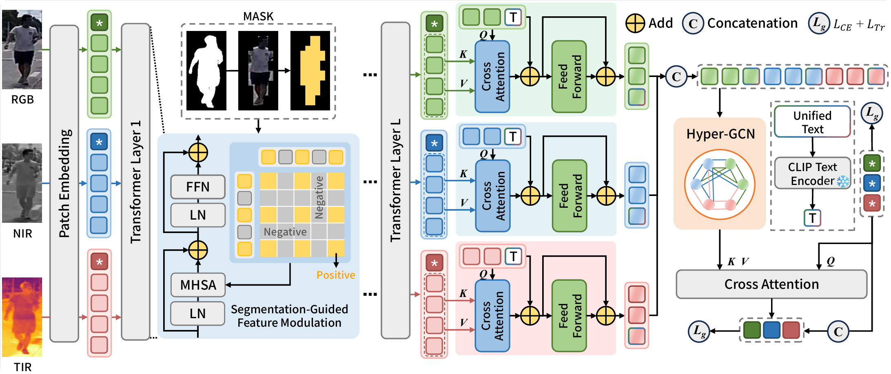
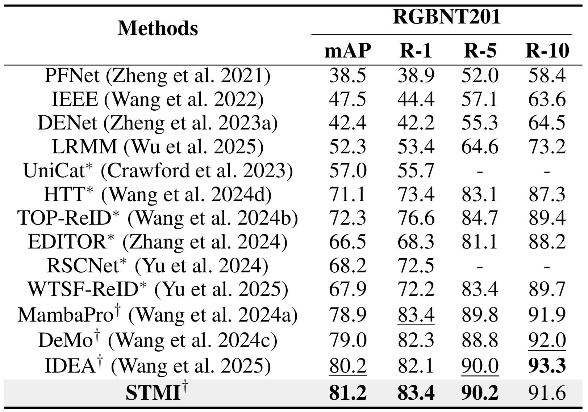
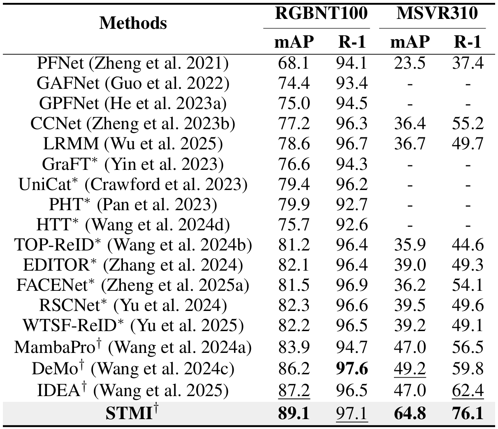

<p align="center">

  <h1 align="center">STMI: Segmentation-Guided Token Modulation and Cross-Modal Hypergraph Interaction for Multi-modal Object Re-Identification</h1>

## **Abstract** 📝
**STMI** is a novel multi-modal object Re-Identification (ReID) framework that introduces **segmentation-guided token modulation**, **semantic token reallocation**, and **cross-modal hypergraph interaction** to overcome foreground-background interference and token-level information loss. By leveraging SAM-generated masks for fine-grained attention modulation, learnable query-based token reconstruction, and high-order inter-modal semantic modeling via hypergraphs, STMI preserves discriminative cues while suppressing noise—achieving state-of-the-art performance across RGB-NIR-TIR benchmarks and setting new standards for robust, interpretable multi-modal ReID.

---
## News 📢
- We released the **STMI** codebase!
- Great news! Our paper has been accepted to **AAAI 2026**! 🏆
---

## **Quick View** 📊
<p align="center">
    
</p>

---

## **Quick Start** 🚀

### Datasets
- **RGBNT201**: [Google Drive](https://drive.google.com/drive/folders/1EscBadX-wMAT56_It5lXY-S3-b5nK1wH)  
- **RGBNT100**: [Baidu Pan](https://pan.baidu.com/s/1xqqh7N4Lctm3RcUdskG0Ug) (Code: `rjin`)  
- **MSVR310**: [Google Drive](https://drive.google.com/file/d/1IxI-fGiluPO_Ies6YjDHeTEuVYhFdYwD/view?usp=drive_link)
- **Annotations** 
- **Masks** 

### Codebase Structure
```
STMI_Codes
├── PTH                           # Pre-trained models
│   └── ViT-B-16.pt               # CLIP model
├── DATA                          # Dataset root directory
│   ├── RGBNT201                  # RGBNT201 dataset
│   │   ├── train_171             # Training images (171 classes) and masks
│   │   │   ├── mask              # Masks
│   │   │   ├── RGB               # RGB modality images
│   │   │   └── ...               # Other modalities images
│   │   ├── test                  # Testing images and masks
│   │   ├── text                  # Annotations
│   │   │   ├── train.json        # Training annotations
│   │   │   └── test.json         # Testing annotations
│   ├── RGBNT100                  # RGBNT100 dataset
│   └── MSVR310                   # MSVR310 dataset
├── assets                        # Github assets
├── config                        # Configuration files
└── ...                           # Other project files
```

### Pretrained Models
- **CLIP**: [Baidu Pan](https://pan.baidu.com/s/1YPhaL0YgpI-TQ_pSzXHRKw) (Code: `52fu`)

  Please download the pretrained weights file, then replace the path on [Line 176](modeling/clip/make_model_clipreid.py#L176) of modeling/clip/make_model_clipreid.py with your local path.

### Configuration
- RGBNT201: `configs/RGBNT201/STMI.yml`  
- RGBNT100: `configs/RGBNT100/STMI.yml`  
- MSVR310: `configs/MSVR310/STMI.yml`

### Training
```bash
conda create -n STMI python=3.10.13
conda activate STMI
pip install torch==2.6.0 torchvision==0.21.0 torchaudio==2.6.0 --index-url https://download.pytorch.org/whl/cu124
cd ../STMI
pip install --upgrade pip
pip install -r requirements.txt
CUDA_VISIBLE_DEVICES=0 python train.py --config_file ./configs/RGBNT201/STMI.yml
```
---

## **Results**
#### Multi-Modal Person ReID 
<p align="center">
  
</p>

#### Multi-Modal Vehicle ReID 
<p align="center">
    
</p>

---
## **Citation** 📚

If you find **STMI** helpful in your research, please consider citing:
```bibtex

```

---